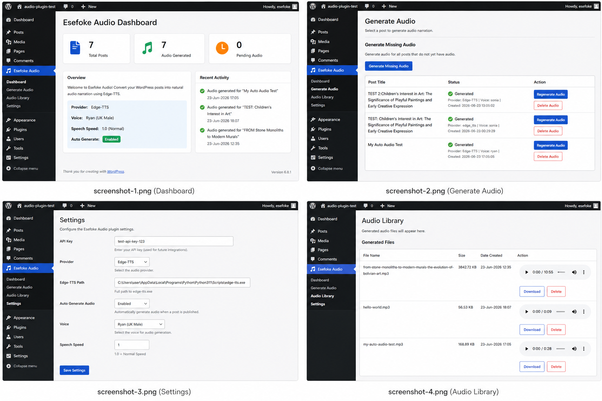
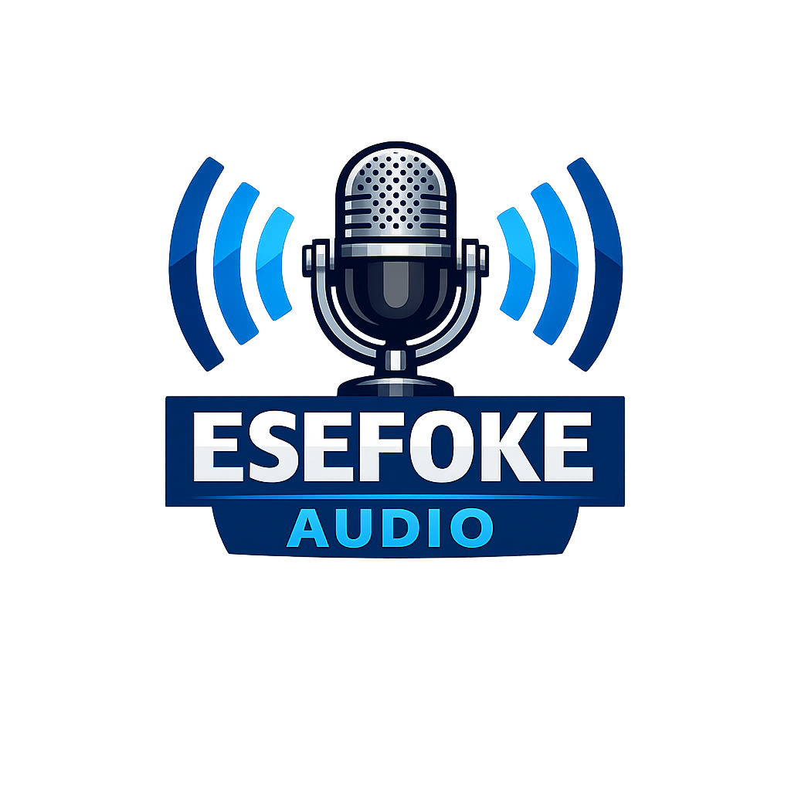
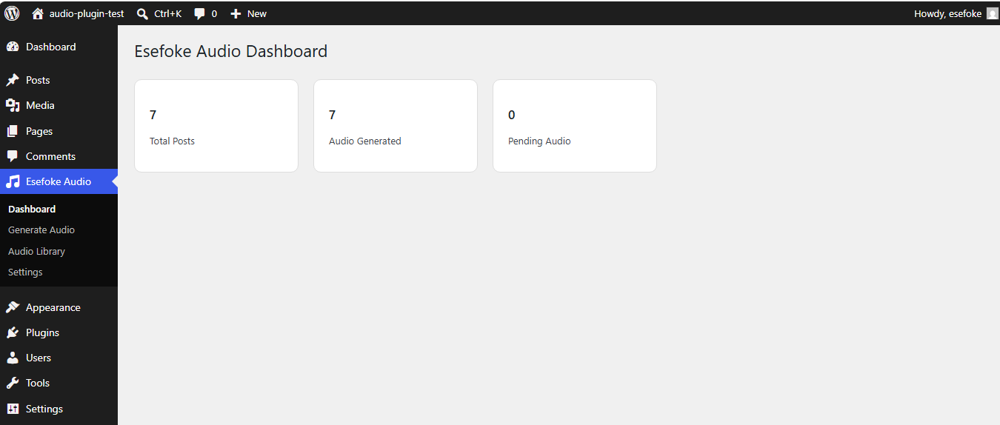
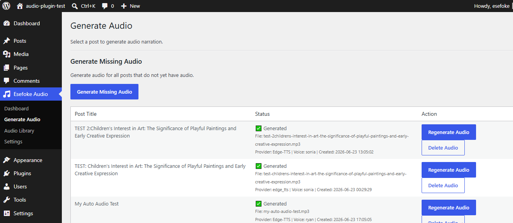
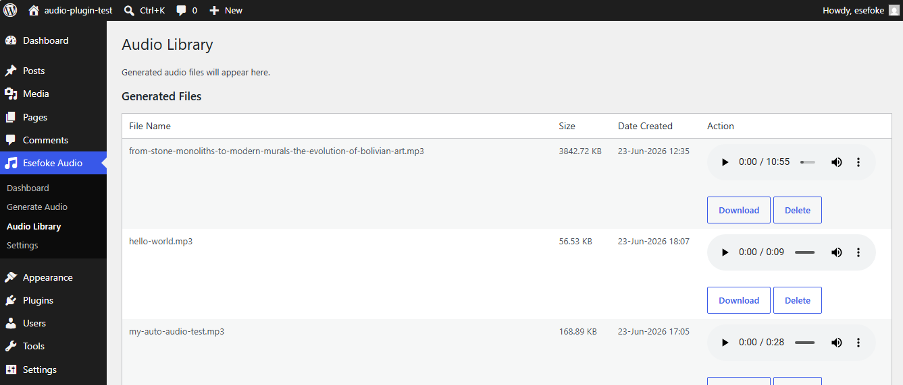
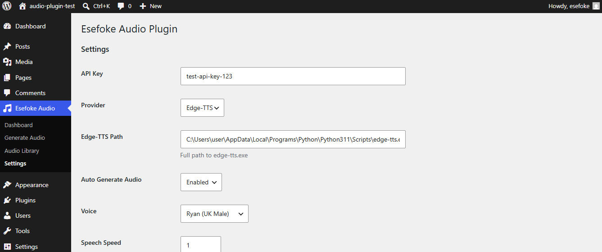

  

<h1 align="center">Esefoke Audio</h1>

Free AI Audio Narration Plugin for WordPress powered by Edge-TTS.

Generate natural-sounding MP3 narration for your WordPress posts without API fees.

  

---

## Features

✅ Free AI voices

✅ Edge-TTS integration

✅ Multiple voice selection

✅ Speech speed control

✅ Automatic audio generation

✅ Generate Missing Audio

✅ Audio Library

✅ Download MP3

✅ Frontend audio player

✅ No API costs

---

## Screenshots

### Dashboard

### Generate Audio

### Audio Library

### Settings

---

## Requirements

* WordPress 6.0+
* PHP 8.0+
* Python 3.11 or later
* Edge-TTS installed

---

## Installation

1. Upload the plugin to WordPress.
2. Activate the plugin.
3. Install Edge-TTS on your computer or server.
4. Enter the Edge-TTS path in the plugin settings.
5. Select your preferred voice.
6. Save settings.
7. Generate audio for your posts.

---

## Supported Voices

### UK Voices

* Ryan (UK Male)
* Sonia (UK Female)

### US Voices

* Jenny (US Female)

Additional Edge-TTS voices can be added in future releases.

---

## Frontend Audio Player

Visitors can:

* Listen directly on your website.
* Download MP3 files.
* Access audio automatically generated from posts.

---

## Version

Current Version: **1.5.0**

---

## Changelog

### Version 1.5.0

* Edge-TTS integration.
* Audio Library.
* Download MP3.
* Frontend player.
* Voice selection.
* Generate Missing Audio.
* Automatic audio generation.

---

## Roadmap

### Version 1.6

* Additional voices.
* Improved frontend player.
* Better audio management.

### Version 2.0

* Bulk audio generation.
* Multiple language support.
* Audio analytics.
* Gutenberg integration.

---

## Download

Latest release:

https://github.com/esefoke/esefoke-audio/releases/latest

---

## Support

For bug reports, feature requests, or suggestions:

https://github.com/esefoke/esefoke-audio/issues

---

## License

GPL v2 or later.

---

## Author

Frank Okenegede

Website:

https://esefoke.xyz

---

## Repository

https://github.com/esefoke/esefoke-audio
